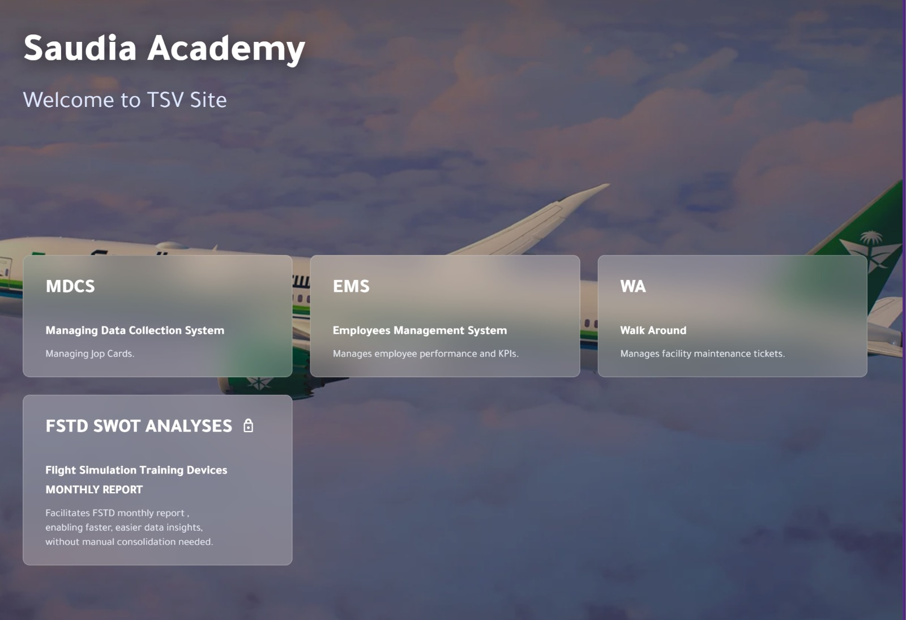

# Saudia Academy TSV Co-op Portal

**emspsaa.com**  
[https://emspsaa.com/](https://emspsaa.com/)

A cooperative training project developed for the **TSV Technical Services Department** at **Saudia Academy**.

This project is an operational portal menu used to provide quick access to selected department systems and project links through a clean, modern, glass-style interface.

> This repository contains a cleaned public version of the portal. Sensitive internal files, passwords, protected folders, and private access logic are intentionally excluded.

---

## Preview

---

## About the Project

The portal was created during my **Co-op Training** experience to organize TSV Technical Services Department tools in one accessible place.

Instead of keeping each system separate or hard to reach, the portal works as a central menu that connects users to the department’s selected systems and project pages.

The live website represents the operational version currently available at:

[https://emspsaa.com/](https://emspsaa.com/)

---

## Included Systems

The portal provides access to selected systems and links, including:

- **MDCS** — Managing Data Collection System
- **EMS** — Employees Management System
- **WA** — Walk Around
- **FSTD SWOT Analyses** — Protected internal section

In the public GitHub version, the FSTD section is kept as a display-only protected card and popup notice. The actual protected access files and internal content are not included.

---

## Public Repository Scope

This repository does **not** include the full internal protected implementation.

The complete operational version includes protected access handling for the FSTD section using a PHP password verification file. However, the PHP file, password logic, protected folders, and sensitive internal content are intentionally excluded from this public repository.

This public version keeps the portal structure, interface, and user experience visible while removing anything that should not be shared publicly.

---

## Features

- Central portal menu for department systems
- Clean glassmorphism-style cards
- Background image with dark overlay
- Department branding area
- External system links
- Protected-section card and popup notice
- Simple JavaScript popup interaction
- Responsive page structure
- Public-safe version for GitHub showcase

---

## Tech Stack

- **HTML5**
- **CSS3**
- **Vanilla JavaScript**
- **PHP** — used in the operational version for protected FSTD access handling
- **Font Awesome**
- **Google Fonts — Tajawal**

---

## Linked Platforms

The portal includes links or references to external and internal department systems, such as:

- **Microsoft Power Apps** for MDCS
- **EMS platform**
- **Firebase-hosted Walk Around system**
- **Internal protected FSTD system** — excluded from this public repository

---

## Important Notes

This repository is intended as a public-safe showcase of the Co-op Training portal.

The following items are intentionally excluded:

- PHP password verification files
- Password files
- Internal protected folders
- Sensitive access logic
- Private department data
- Internal-only resources
- Full protected FSTD implementation

---

## Project Status

The portal is a real project created during Co-op Training and used as a central access menu for TSV department systems.

This GitHub repository contains a cleaned public version that preserves the interface and project structure while excluding sensitive internal implementation details.

---

## Developed During

**Co-op Training**  
Saudia Academy — TSV Technical Services Department